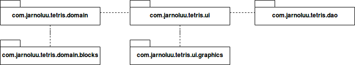
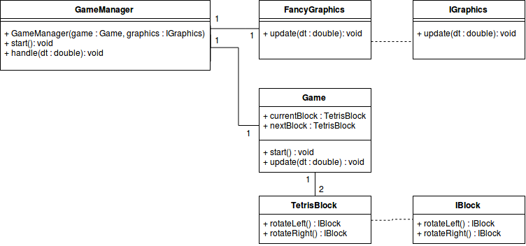
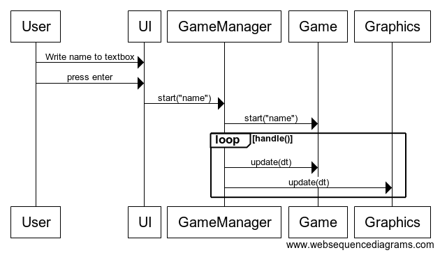

# Arkkitehtuurikuvaus

## Rakenne

Ohjelmassa on kolme ylimmän tason pakkausta. Pakkaus `com.jarnoluu.tetris.domain` pitää sisällään sovelluslogiikan, sekä pakkauksen `blocks` jossa on palikoiden käsittelyä koskevat luokat. Pakkauksessa `com.jarnoluu.tetris.ui` on JavaFX:llä toteutettu käyttöliittymä, sekä pakkaus `graphics` joka hoitaa ulkoasun piirtämisen tarkemmin. `com.jarnoluu.tetris.dao` hoitaa pistelistan pysyväistallennuksen.

## Käyttöliittymä

Käyttöliittymässä on kolme erilaista näkymää:

- nimen syöttäminen ennen peliä
- pelin pelaaminen
- pelin jälkeinen pistelista

Itse peli ja pelin statistiikkoen piirtäminen on eriytetty täysin pelilogiikasta, ja ne piirretään kahteen JavaFX kanvakseen, jotka annetaan konstruktorissa piirtämisen hoitavalle luokalle.

Nimen syöttäminen on toteutettu luomalla [VBox](https://docs.oracle.com/javase/8/javafx/api/javafx/scene/layout/VBox.html), joka sijoitetaan uudeksi tasoksi muiden komponenttien päälle. VBoxin lapsena on [TextField](https://docs.oracle.com/javase/8/javafx/api/javafx/scene/control/TextField.html). Pelin alkaessa VBox-taso piilotetaan.

## Sovelluslogiikka

Pelitilanteen ja grafiikoiden jatkuvan päivittämisen hoittaa luokka `GameManager`, joka saa `Game` ja `IGraphics` ilmentymät argumentteina konstruktorissa.

Luokka `Game` hoitaa pelin logiikan ja pelitilanteen etenemisen.

Peliin voisi toteuttaa useita erilaisia graafisia vaihtoehtoja toteuttamalla `IGraphics` rajapinnan, mutta nyt sen on toteuttanut vain yksi luokka `FancyGraphics`.

Luokassa `Game` ei ole muita tärkeitä ulospäin näkyviä metodeja kuin `start` ja `ùpdate`, sekä liikuteltavaa palikkaa hallinnoivat metodit (`moveLeft`, `moveRight`, `moveDown` ja `rotate`). Siinä on kuitenkin kaksi protected-metodia (`findExplosions` ja `freezeBlock`). Normaalisti niitä kutsutaan täysin luokan sisäisesti `update` metodista lähtevän kutsuketjun avulla, mutta testauksen helpottamiseksi on tehty kompromissi.

## Tietojen pysyväistallennus

Pakkaus `com.jarnoluu.tetris.dao` hoitaa pelin pistelistan pysyväistallennuksen internetiin. [ei vielä toteutettu]

## Päätoiminnallisuudet

Sekvenssikaaviona pelin aloittaminen:

