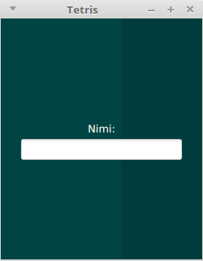

# Käyttöohje

Lataa tiedosto [tetris.jar](https://github.com/kalppi/otm-harjoitustyo/releases/tag/loppupalautus)

## Konfigurointi

Sovellusta ei tarvitse konfiguroida.

## Ohjelman käyttistäminen

Ohjelma käynnistetään komennolla

```
java -jar tetris.jar
```

## Nimen valinta

Sovellus aukeaa nimen valitsemiseen:



Nimen täytyy olla vähintään kolme merkkiä. Hyväksyminen tapahtuu rivinvaihtoa painamalla.