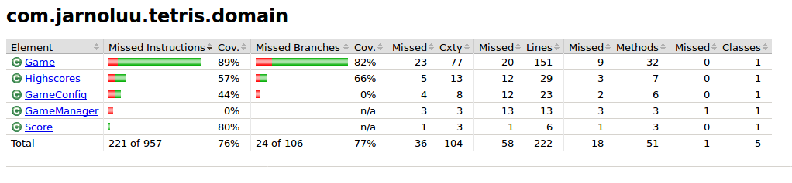

# Testausdokumentti

Ohjelmaa on testattu automatisoiduin yksikkö- ja integraatiotestain JUnitilla sekä manuaalisesti tapahtunein järjestelmätason testein.

## Sovelluslogiikan testaus

Sovelluslogiikkaa eli pakkausta [com.jarnoluu.tetris.domain](https://github.com/kalppi/otm-harjoitustyo/tree/master/src/main/java/com/jarnoluu/tetris/domain) testaavat [GameTest](https://github.com/kalppi/otm-harjoitustyo/tree/master/src/test/java/com/jarnoluu/tetris/domain/GameTest.java), [HighscoresTest](https://github.com/kalppi/otm-harjoitustyo/tree/master/src/test/java/com/jarnoluu/tetris/domain/HighscoresTest.java) ja [TetrisBlockTest](https://github.com/kalppi/otm-harjoitustyo/tree/master/src/test/java/com/jarnoluu/tetris/domain/blocks/TetrisBlockTest.java).

## Testauskattavuus

Käyttöliittymäkerrosta lukuunottamatta sovelluksen testauksen rivikattavuus on 76% ja haarautumakattavuus 77%.

## Järjestelmätestaus

Sovelluksen järjestelmätestaus on suoritettu manuaalisesti.

## Asennus ja kanfigurointi

Sovellus on haettu ja sitä on testattu [käyttöohjeen](kayttoohje.md) kuvaamalla tavalla Linux-ympäristössä. Sovellus on käynnistetty olemassa olevalla `config`-tiedostolla, sekä myös ilman.